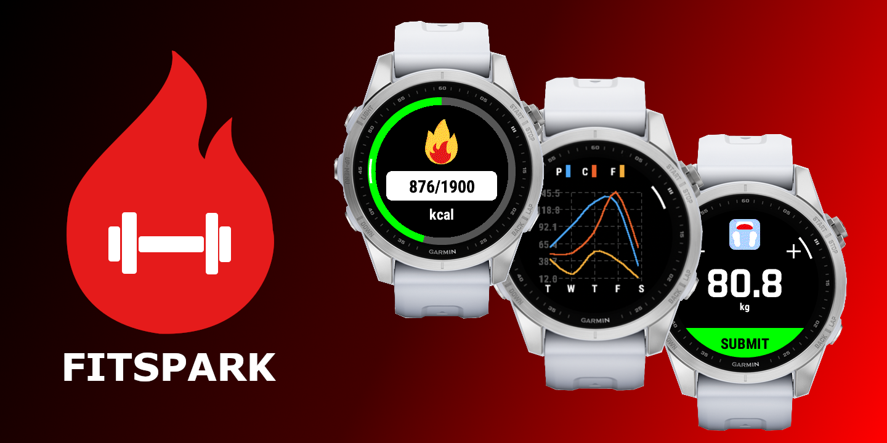
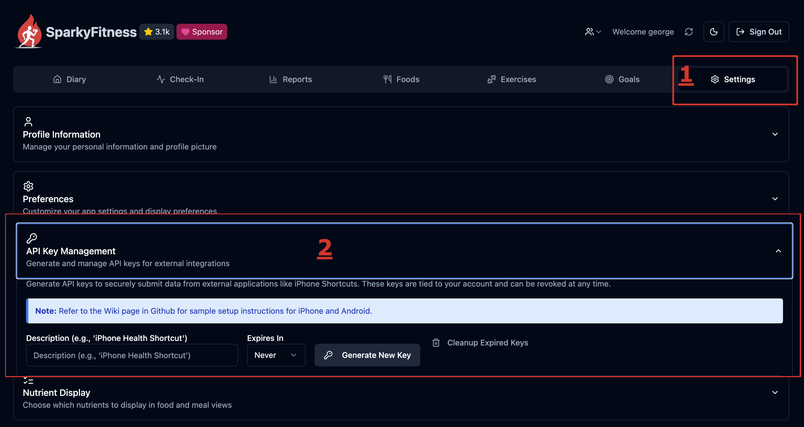
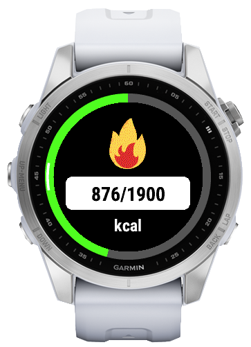
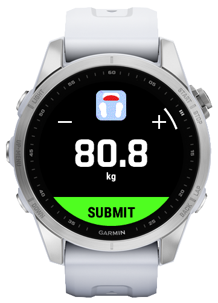
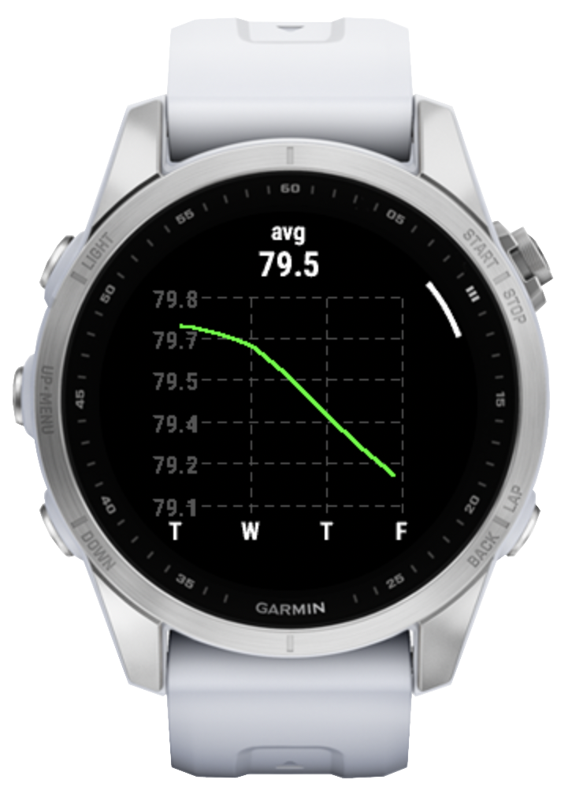
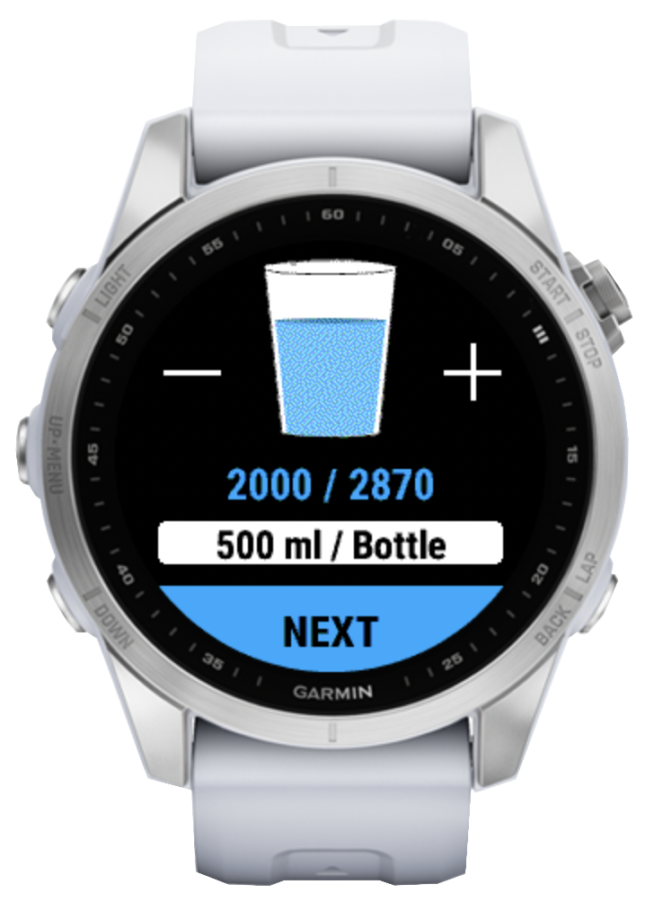
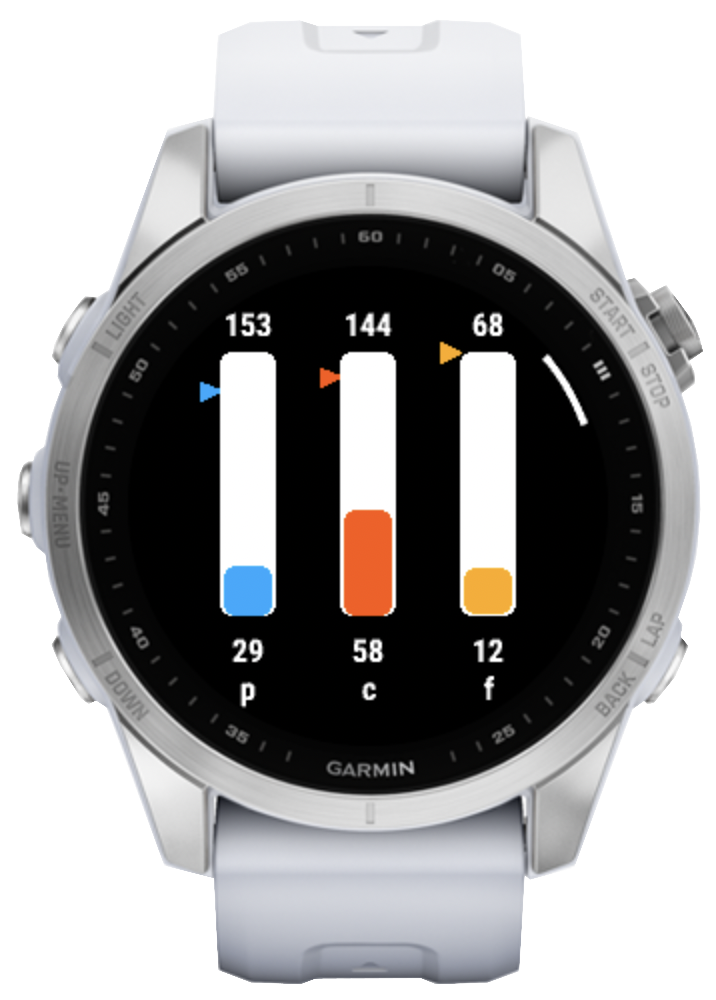
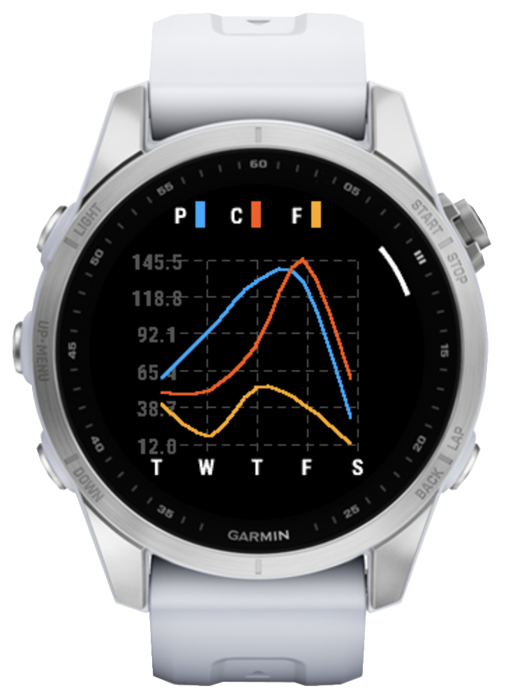
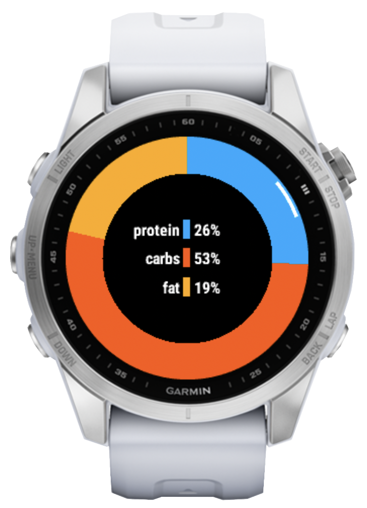

# FitSpark – Your Garmin Companion for SparkyFitness

Welcome to **FitSpark**, a Garmin companion app designed for Garmin smartwatches. FitSpark brings your daily fitness and nutrition goals directly to your wrist, letting you monitor calories, weight, water intake, and macronutrients in real time—all without pulling out your phone. FitSpark is built for the SparkyFitness ecosystem.

## Table of Contents

- [**1. What is FitSpark?**](#1-what-is-fitspark)
- [**2. What Can FitSpark Do?**](#2-what-can-fitspark-do)
- [**3. Getting Started**](#3-getting-started)
  - [**3.1 Prerequisites**](#31-prerequisites)
  - [**3.2 Compatibility**](#32-compatibility)
  - [**3.3 Installation**](#33-installation)
  - [**3.4 Supported Watches**](#34-supported-watches)
  - [**3.5 Sideloading**](#35-sideloading)
- [**4. About SparkyFitness & API Keys**](#4-about-sparkifitness--api-keys)
  - [**4.1 SparkyFitness Thanks**](#41-sparkifitness-thanks)
  - [**4.2 Getting the API key for FitSpark**](#42-getting-the-api-key-for-fitspark)
- [**5. How to Use FitSpark**](#5-how-to-use-fitspark)
  - [**5.1 Navigating the App**](#51-navigating-the-app)
  - [**5.2 Initial Setup**](#52-initial-setup)
  - [**5.3 Screen-by-Screen Guide**](#53-screen-by-screen-guide)
    - [**5.3.1 Overview Screen (Home)**](#531-overview-screen-home)
    - [**5.3.2 Weight Screen**](#532-weight-screen)
    - [**5.3.3 Weight Graph Screen**](#533-weight-graph-screen)
    - [**5.3.4 Water Intake Screen**](#534-water-intake-screen)
    - [**5.3.5 Macronutrients Screen (Nutrition)**](#535-macronutrients-screen-nutrition)
    - [**5.3.6 Nutrition Trends Screen (Last 4 Days)**](#536-nutrition-trends-screen-last-4-days)
    - [**5.3.7 Nutrition Pie Screen (Today's Macro Breakdown)**](#537-nutrition-pie-screen-todays-macro-breakdown)
- [**6. Customization & Settings**](#6-customization--settings)
  - [**6.1 Main Menu Options**](#61-main-menu-options)
- [**7. ⚡ Troubleshooting**](#7--troubleshooting)
- [**8. Frequently Asked Questions**](#8-frequently-asked-questions)
- [**9. Roadmap**](#9-roadmap)
- [**10. Need More Help?**](#10-need-more-help)
- [**11. Disclaimer**](#11-disclaimer)

---

## **1. What is FitSpark?**

FitSpark is a Garmin Connect IQ application that connects to your fitness backend API to display your personalized health and nutrition data. Whether you're tracking your daily calorie intake, monitoring your weight journey, staying hydrated, or keeping an eye on your macro goals (protein, carbs, and fats), FitSpark keeps you informed and motivated throughout your day.

---

## **2. What Can FitSpark Do?**

### 📊 Daily Overview
Get a quick snapshot of your day's calories consumed versus your daily calorie goal. Perfect for a glance to see if you're on track or need to adjust your intake.

### ⚖️ Weight Tracking
- View your current weight
- Manually log new weight entries directly from your watch (great for morning weigh-ins!)

### 💧 Water Intake Monitoring
- Track how much water you've consumed today
- Log water drinks easily with +/− controls on touchscreen devices
- Use water containers already defined inside SparkyFitness

### 🥗 Macronutrient Tracking
Monitor your daily nutrition targets:
- **Protein** – See how much you've consumed vs. your daily goal
- **Carbohydrates** – Track your carb intake against your goal
- **Fats** – Monitor your fat consumption with your personalized target

View all three macros at a glance to ensure you're hitting your nutritional targets.

### 📈 Nutrition Trends (Last 5 Days)
See how your macronutrient intake has trended over the past few days:
- Visualize your protein, carbs, fats, and calorie patterns
- Identify eating habits and adjust as needed
- Track your progress with trend lines and data points

### 📉 Weight History (Last 7 Days)
Monitor your weight journey over the past week:
- See your weight progression in a simple, easy-to-understand format
- Identify trends and celebrate progress
- Stay motivated by visualizing your weight tracking efforts

---

## **3. Getting Started**

### **3.1 Prerequisites**

1. **Compatible Garmin Watch**
   - A Garmin Watch with Touchscreen and 5 buttons configuration.
   - Your watch must be able to connect to the internet (via Bluetooth to your phone)

2. **SparkyFitness Deployed**
   - SparkyFitness deployed and working
   - Custom domain/NGINX reverse proxy or other methods to have SparkyFitness under https since garmin does not allow any request from watch to an http domain.

### **3.2 Compatibility**

FitSpark was partially tested and should work with the following SparkyFitness versions:
| SparkyFitness Version | Status |
|-------|--------|
| < v0.16.6.0 | ❓ Unknown |
| v0.16.6.x | ✅ Supported |

### **3.3 Installation**

1. **Install from Garmin Connect IQ Store** (when published)
   - Search for "FitSpark" in the Garmin Connect IQ app store on your watch or via the Garmin Connect app on your phone.

2. **Build from source and sideload** (for developers)
   - I recomend to hardcode api key inside strings since due to garmin stirng limitation you can't set that on the watch directly
   - See [CONTRIBUTING.md](CONTRIBUTING.md) for technical setup instructions.

### **3.4 Supported Watches**

FitSpark requires a Garmin smartwatch with a **touchscreen** and **5-button configuration**. The app has been configured for various Garmin models. Here are the supported watches from the current build manifest:

| Model | Status |
|-------|--------|
| fēnix® 7 | ✅ Supported |
| fēnix® 7 Pro | ✅ Supported |
| fēnix® 7 Pro (No Wi-Fi) | ✅ Supported |
| fēnix® 7S | ✅ Tested |
| fēnix® 7S Pro | ✅ Supported |
| fēnix® 7X | ✅ Supported |
| fēnix® 7X Pro | ✅ Supported |
| fēnix® 7X Pro (No Wi-Fi) | ✅ Supported |
| fēnix® 8 43mm | ✅ Supported |
| fēnix® 8 47mm | ✅ Supported |
| fēnix® 8 Pro 47mm | ✅ Supported |
| fēnix® 8 Solar 47mm | ✅ Supported |
| fēnix® 8 Solar 51mm | ✅ Supported |
| fēnix® E | ✅ Supported |
| Forerunner® 570 42mm | ✅ Supported |
| Forerunner® 570 47mm | ✅ Supported |
| Forerunner® 970 | ✅ Supported |
| instinct® 3 AMOLED 45mm | ✅ Supported |
| instinct® 3 AMOLED 50mm | ✅ Supported |

> [!NOTE]
> "Tested" watches have confirmed working installations. "Supported" watches should work based on technical compatibility but may require additional testing.

> [!WARNING]
> Watches without touchscreen capabilities may experience navigation issues or app crashes and lack of some pages.

### **3.5 Sideloading**

Steps:
* Get .prg file for your watch from release or by building
* Connect watch to PC
* Navigate to GARMIN/APPS
* Drop .prg file inside the folder

> [!WARNING]
> If you use sideloading you will not have the controls inside GARMIN IQ app, all settings needs to be done from the watch.

---

## **4. About SparkyFitness & API Keys**

FitSpark uses the SparkyFitness backend to power its watch experience. SparkyFitness handles your profile, goals, nutrition targets, weight history, water intake, and calories so that FitSpark can display them on your Garmin device.

- **SparkyFitness GitHub repo:** https://github.com/CodeWithCJ/SparkyFitness
- **SparkyFitness documentation:** https://codewithcj.github.io/SparkyFitness/

### **4.1 SparkyFitness Thanks**

SparkyFitness is the backend service that makes FitSpark possible. Without the backend, FitSpark cannot retrieve or sync your health and nutrition data, which means there would be no calories, macros, weight, or water tracking on the watch.

> [!IMPORTANT] 
> Special thanks to the SparkyFitness project for making this app possible.

### **4.2 Getting the API key for FitSpark**

FitSpark requires a SparkyFitness API key so it can authenticate on behalf of your account.

1. Open the SparkyFitness dashboard.
2. Sign in to your SparkyFitness account.
3. Go to Settings.
4. Go to 'API Key Management'
5. Generate a new API key for FitSpark.
6. Copy the key and save it securely.

---

## **5. How to Use FitSpark**

### **5.1 Navigating the App**

FitSpark displays your fitness data across multiple screens that you can navigate through:

**On Touchscreen Devices:**
- Swipe left/right to move between screens
- Tap buttons to interact with controls
- Use +/− buttons to adjust values

**On Non-Touchscreen Devices:**
- Use the side buttons to navigate between screens
- You will be unable to set/update values

**Open the menu** from any screen by pressing your watch's Menu button or using the hardware/menu key on supported models. From there you can access sync settings, view options, glance data, and reminders.

### **5.2 Initial Setup**

Upon first launch you must:
1. Navigate to menu on Garmin Connect App
2. Go to 'Settings'
3. Enter your server address (https is required, only address is needed not "https://")
4. Enter your SparkyFitness API key

After configuration restart the app and FitSpark will:
1. Fetch your profile information from your fitness backend (name, age, height, etc.)
2. Load your current weight and height
3. Retrieve your daily nutrition goals
4. Sync your historical data

**Note:** FitSpark requires an active internet connection on your watch (via phone sync) to fetch and update data.

### **5.3 Screen-by-Screen Guide**

#### **5.3.1 Overview Screen (Home)**

#### **5.3.2 Weight Screen**

#### **5.3.3 Weight Graph Screen**

#### **5.3.4 Water Intake Screen**

#### **5.3.5 Macronutrients Screen (Nutrition)**

#### **5.3.6 Nutrition Trends Screen (Last 4 Days)**

#### **5.3.7 Nutrition Pie Screen (Today's Macro Breakdown)**

---

## **6. Customization & Settings**

Press the **Menu** button on your watch to access settings.

### **6.1 Main Menu Options**

#### **6.1.1 Glance Data**
Manage what information appears in your Garmin Glance (the quick-view feature on your watch face). You can select the mobile summary nutrient data shown by the glance sync menu.

#### **6.1.2 Sync Settings**
- **HOST** (text)
  - Server endpoint (https only)
- **API KEY** (text)
  - SparkyFitness API key
- **Glance Sync** (On/Off)
  - Enable to have your watch glance auto-update with the latest data
  - Disable to save battery and reduce background sync activity

#### **6.1.3 View Settings**
Choose which screens appear in your app:
- **Calories** (On/Off) – Show/hide the calories overview screen
- **Nutrition** (On/Off) – Show/hide the macronutrients screen
- **Nutrition Trends** (On/Off) – Show/hide the 4-day trends chart
- **Nutrition Pie** (On/Off) – Show/hide the pie chart visualization (if available)
- **Hydration** (On/Off) – Show/hide the water intake screen on touchscreen devices
- **Weight** (On/Off) – Show/hide the weight logging screen
- **Weight Trends** (On/Off) – Show/hide the 7-day weight history

**Pro Tip:** Customize your screens based on what matters most to you. If you only care about calories and water, disable the other views for faster navigation.

---

## **7. ⚡ Troubleshooting**

**App shows old data:**
- Ensure your watch has an internet connection (Bluetooth to your phone)
- Open the app and wait for it to sync
- Check that your phone is connected to WiFi or mobile data
- Check SparkyFitness server is available

**Can't log weight or water:**
- Verify you have internet connectivity
- Make sure your API key is valid and up to date
- Try restarting the app
- Make sure you're on a supported touchscreen device for logging controls

**Screens not showing up:**
- Check your View Settings to ensure they're enabled
- Open the menu and confirm the screen toggles are set correctly
- Return to the home screen and navigate again

---

## **8. Frequently Asked Questions**

**Q: Does FitSpark require a phone?**
A: Yes. Your watch needs a Bluetooth connection to a phone that provides internet access.

**Q: Can I use a non-touchscreen watch?**
A: You can view data on some non-touchscreen devices, but logging controls usually require a touchscreen.

**Q: Do I need a SparkyFitness account?**
A: Yes. FitSpark relies on SparkyFitness for backend data and requires a valid API key.

---

## **9. Need More Help?**

For developer setup and build instructions, see `CONTRIBUTING.md`.
If the repository supports issue tracking, open an issue with your device model, firmware version, and any error details.

---

## **10. Roadmap**

These are planned improvements, but no features are guaranteed:
- User preference sync (kg/lbs and unit settings)
- Custom nutrients (in progress)
- Customizable main nutrient priorities (in progress)
- Food logging support

---

## **11. Disclaimer**

No additional features are promised.
No future updates are guaranteed.

> THE SOFTWARE IS PROVIDED "AS IS", WITHOUT WARRANTY OF ANY KIND, EXPRESS OR IMPLIED, INCLUDING BUT NOT LIMITED TO THE WARRANTIES OF MERCHANTABILITY, FITNESS FOR A PARTICULAR PURPOSE AND NONINFRINGEMENT. IN NO EVENT SHALL THE AUTHORS OR COPYRIGHT HOLDERS BE LIABLE FOR ANY CLAIM, DAMAGES OR OTHER LIABILITY, WHETHER IN AN ACTION OF CONTRACT, TORT OR OTHERWISE, ARISING FROM, OUT OF OR IN CONNECTION WITH THE SOFTWARE OR THE USE OR OTHER DEALINGS IN THE SOFTWARE.